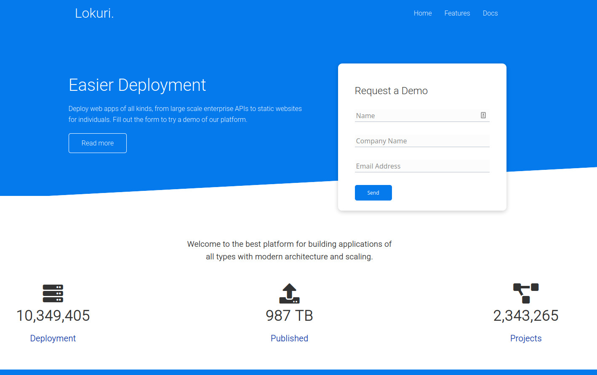

# Lokuri
**Purpose** Lorkui is a responsive website that will be used to get users to use their software to deploy web applications of all kinds.

Check out the <a target="_blank" href="https://github.com/xcChinaxc/lokuri-cr-responsive-website">repo</a> and the <a target="_blank" href="https://lokuri-cr-responsive-site.herokuapp.com/">demo site</a> here!

## How It's Made
**Tech used:** HTML, CSS Grid, CSS Animation, Flexbox
**Lessons Learned** I worked on this project for a little more practice with the bo model and CSS Grid. During this project, I learned how to:
- use CSS Animations
- assign a global variable using the root selector for CSS color variables
